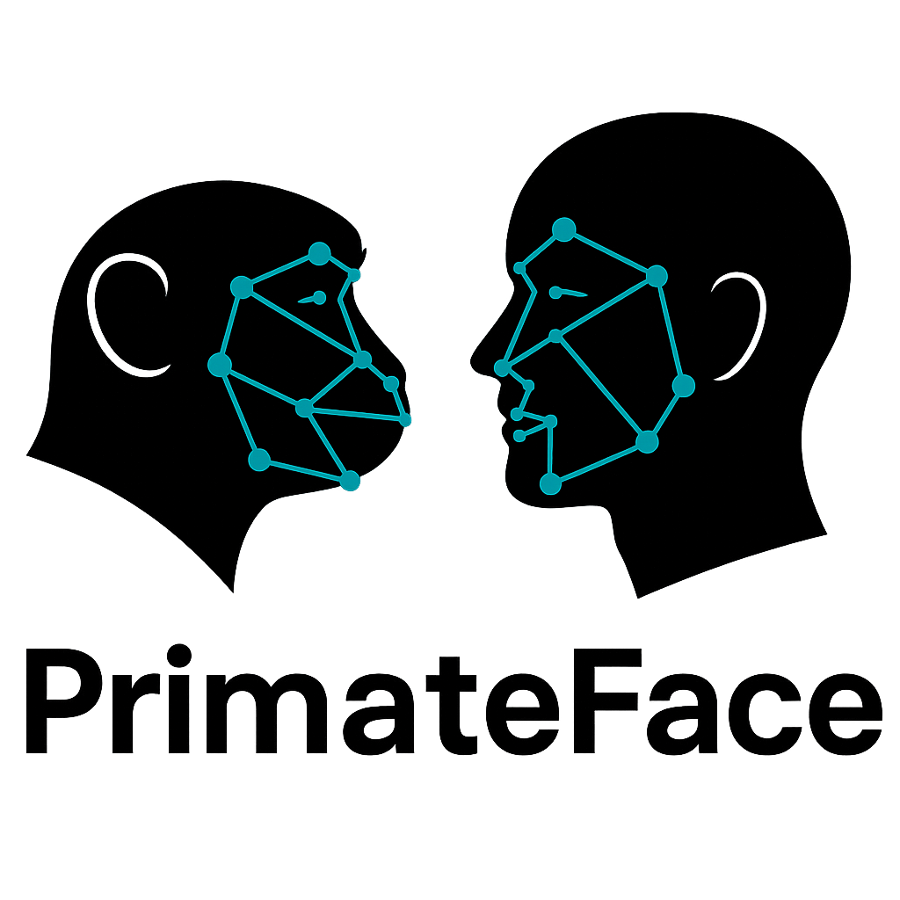

# **PrimateFace: A Machine Learning Resource for Automated Primate Face Analysis**

<p align="center">
  <a href="https://www.biorxiv.org/content/10.1101/2025.08.12.669927v2">
    
  </a>
  &nbsp;&nbsp;
  <a href="https://primateface.studio/">
    
  </a>
  &nbsp;&nbsp;
  <a href="https://docs.primateface.studio">
    
  </a>
    &nbsp;&nbsp;
  <a href="https://huggingface.co/datasets/fparodi/PrimateFace">
    
  </a>
</p>

PrimateFace contains data, models, and tutorials for analyzing facial behavior across primates ([Parodi et al., 2025](https://www.biorxiv.org/content/10.1101/2025.08.12.669927v2)). 

This codebase enables you to use an off-the-shelf PrimateFace model for tracking facial movements or you can quickly fine-tune a PrimateFace model.

Most of the PrimateFace modules require GPU access. If you don't have access to a GPU, you can still use PrimateFace in Google Colab (see [notebooks](https://docs.primateface.studio/notebooks/index.html)).


<p align="center">
  
</p>


#### **Quick Start**
1. Test the [Hugging Face demo](https://huggingface.co/datasets/fparodi/PrimateFace) to get a feel for the capabilities of PrimateFace on your own data.

2. Run through the [Google Colab Notebook tutorials](https://docs.primateface.studio/notebooks/index.html) to explore several applications of PrimateFace.

3. Clone this repository, install the dependencies, and run through the different modules (e.g., DINOv2, image and video demos, pseudo-labeling GUI, etc.) to fully utilize PrimateFace.


#### Structure
This repository contains the code for PrimateFace, an ecosystem for facilitating cross-species primate face analysis.

```
|--- dataset            # Explore PrimateFace data
|--- demos              # Test models on your own data
   |--- notebooks       # Google Colab notebooks for tutorials
|--- dinov2             # Run and visualize DINOv2 features
|--- docs               # Documentation for PrimateFace
|--- evals              # Evaluate models across frameworks & datasets
|--- gui                # Run pseudo-labeling GUI on your own data
|--- landmark-converter # Train & apply keypoint landmark converters (68 -> 48 kpts)
|--- pyproject.toml
|--- README.md
|--- environment.yml    # Unified conda environment for modules
```


#### Installation

Follow these steps to install PrimateFace:

**Step 1: Create conda environment**
```bash
# Create environment with base dependencies (numpy, opencv, etc.)
conda env create -f environment.yml
conda activate primateface
```

**Step 2: Install PyTorch for your system**
Check your CUDA version and the corresponding PyTorch version [here](https://pytorch.org/get-started/previous-versions/).

```bash
# Install uv for faster package management (if not already installed)
pip install uv

# Check your CUDA version:
nvcc --version

# Choose ONE based on your CUDA version: 11.8, 12.1, or CPU only
# For example, for CUDA 11.8:
uv pip install torch==2.1.0 torchvision==0.16.0 --index-url https://download.pytorch.org/whl/cu118
uv pip install torch torchvision --index-url https://download.pytorch.org/whl/cu121
uv pip install torch torchvision --index-url https://download.pytorch.org/whl/cpu

# Verify PyTorch installation
python -c "import torch; print(f'PyTorch {torch.__version__}, CUDA: {torch.cuda.is_available()}')"
```

**Step 3: Install optional modules**
```bash
# Recommended: Install multiple modules at once (includes testing tools):
uv pip install -e ".[dinov2,gui,dev]"

# Or install individually:
# For DINOv2 feature extraction:
uv pip install -e ".[dinov2]"

# For GUI (includes YOLO/Ultralytics):
uv pip install -e ".[gui]"

# For development/testing tools (pytest, black, etc.):
uv pip install -e ".[dev]"

# For the graph neural network landmark converter (advanced users):
# uv pip install -e ".[landmark_gnn]"
```

Note: You may see a harmless `RequestsDependencyWarning` about urllib3 versions - this can be safely ignored.

**Step 4: Install detection and pose estimation frameworks** (install only what you need):
- **MMDetection/MMPose**: See [demos/README.md](demos/README.md)
- **DeepLabCut**: See [evals/dlc/README.md](evals/dlc/README.md)
- **SLEAP**: See [evals/sleap/README.md](evals/sleap/README.md)


#### Links
- [Documentation Homepage](https://docs.primateface.studio)
- [Notebook Tutorials](https://docs.primateface.studio/notebooks/index.html)

<!-- TODO: fix links for KordingLab -->

| Tutorial | Open in Colab |
|---------|----------------|
| **1. Lemur Face Visibility Time-Stamping** | [](https://colab.research.google.com/github/PrimateFace/primateface_oss/blob/main/demos/notebooks/App1_Lemur_time_stamping.ipynb) |
| **2. Rapid Macaque Face Recognition** | [](https://colab.research.google.com/github/PrimateFace/primateface_oss/blob/main/demos/notebooks/App2_Macaque_Face_Recognition.ipynb) |
| **3. Howler Vocal-Motor Coupling** | [](https://colab.research.google.com/github/PrimateFace/primateface_oss/blob/main/demos/notebooks/App3_Howler_Vocal_Motor_Coupling.ipynb) |
| **4. Human Infant Social Gaze Tracking** | [](https://colab.research.google.com/github/PrimateFace/primateface_oss/blob/main/demos/notebooks/App4_Gaze_following.ipynb) |
| **5. Data-Driven Discovery of Facial Actions** | [](https://colab.research.google.com/github/PrimateFace/primateface_oss/blob/main/demos/notebooks/App5_Data_Driven_Discovery_of_Facial_Actions.ipynb) |
| **6. Cross-Subject Neural Decoding of Facial Actions** | [](https://colab.research.google.com/github/PrimateFace/primateface_oss/blob/main/demos/notebooks/App6_Cross_Subject_Neural_Decoding_of_Facial_Actions.ipynb) |


#### References
If you use PrimateFace in your research, please cite:

    Parodi, Felipe, et al. "PrimateFace: A Machine Learning Resource for Automated Face Analysis in Human and Non-human Primates." bioRxiv (2025): 2025-08.

BibTeX:

    @article{parodi2025primateface,
    title={PrimateFace: A Machine Learning Resource for Automated Face Analysis in Human and Non-human Primates},
    author={Parodi, Felipe and Matelsky, Jordan and Lamacchia, Alessandro and Segado, Melanie and Jiang, Yaoguang and Regla-Vargas, Alejandra and Sofi, Liala and Kimock, Clare and Waller, Bridget M and Platt, Michael and others},
    journal={bioRxiv},
    pages={2025--08},
    year={2025},
    publisher={Cold Spring Harbor Laboratory}
    }

#### Contact

For questions or collaborations, reach out via:
- PrimateFace Email: [primateface@gmail.com](mailto:primateface@gmail.com)
- Felipe Parodi Email: [fparodi@upenn.edu](mailto:fparodi@upenn.edu)

#### Contributors
- **Felipe Parodi**, University of Pennsylvania
- **Jordan Matelsky**, University of Pennsylvania; Johns Hopkins University Applied Physics Laboratory
- **Alessandro Lamacchia**, University of Pennsylvania
- **Melanie Segado**, University of Pennsylvania
- **Yao Jiang**, University of Pennsylvania
- **Alejandra Regla-Vargas**, University of Pennsylvania
- **Liala Sofi**, University of Pennsylvania
- **Clare Kimock**, Nottingham Trent University
- **Bridget Waller**, Nottingham Trent University
- **Michael L. Platt<sup>*</sup>**, University of Pennsylvania
- **Konrad P. Kording<sup>*</sup>**, University of Pennsylvania; Learning in Machines & Brains, CIFAR

PrimateFace is maintained by the [Kording](https://kordinglab.com/) and [Platt labs](https://plattlabs.rocks/) at the University of Pennsylvania.


#### License
PrimateFace is released under the MIT License. 


#### Acknowledgements

We thank the developers of foundational frameworks that enabled this project, including:

| Category                | Framework/Resource | Link |
|-------------------------|--------------------|------|
| Face Analysis           | **InsightFace**    | [https://github.com/deepinsight/insightface](https://github.com/deepinsight/insightface) |
|                         | **GazeLLE**        | [https://github.com/fkryan/gazelle](https://github.com/fkryan/gazelle) |
| Comp. Ethology       | **DeepLabCut**     | [https://github.com/DeepLabCut/DeepLabCut](https://github.com/DeepLabCut/DeepLabCut) |
|                         | **SLEAP**          | [https://github.com/murthylab/sleap](https://github.com/murthylab/sleap) |
|                         | **MotionMapper**   | [https://github.com/gordonberman/MotionMapper](https://github.com/gordonberman/MotionMapper) |
| General ML/CV           | **MMDetection**    | [https://github.com/open-mmlab/mmdetection](https://github.com/open-mmlab/mmdetection) |
|                         | **MMPose**         | [https://github.com/open-mmlab/mmpose](https://github.com/open-mmlab/mmpose) |
|                         | **DINOv2**         | [https://github.com/facebookresearch/dinov2](https://github.com/facebookresearch/dinov2) |
|                         | **Hugging Face**   | [https://huggingface.co](https://huggingface.co) |
