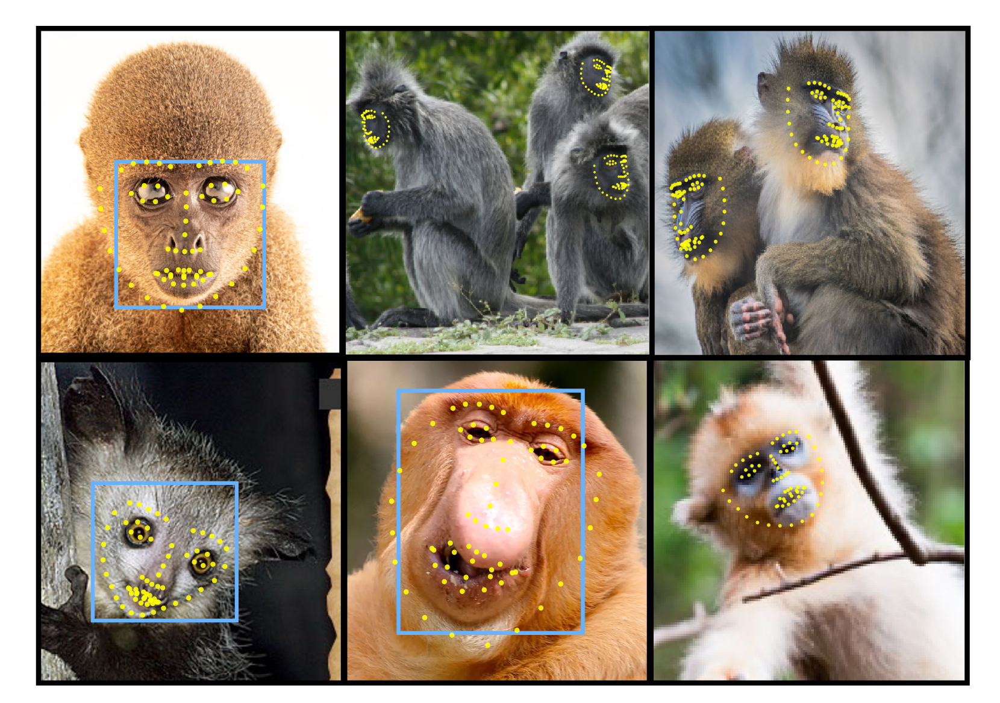

# PrimateFace Demo Scripts

Quick-start demos for primate face detection, pose estimation, and analysis.

## Framework Requirements

**IMPORTANT**: These demos require **MMDetection and MMPose** frameworks. Other frameworks (YOLO, etc.) are not yet supported.



## Quick Start with OpenMMLab

### 1. Install Dependencies

```bash
# After activating primateface conda environment and installing torch:
uv pip install -U openmim "numpy<2.0"

# Install MMDetection/MMPose (SSL cert. workaround included)
mim install mmengine==0.10.3 --trusted-host download.openmmlab.com --trusted-host pypi.org
mim install "mmcv==2.1.0" --trusted-host download.openmmlab.com --trusted-host pypi.org
mim install "mmdet==3.2.0" --trusted-host download.openmmlab.com --trusted-host pypi.org
mim install "mmpose==1.3.2" --trusted-host download.openmmlab.com --trusted-host pypi.org
```

### 2. Download pretrained models

```bash
cd demos
python download_models.py  # Downloads to current directory
# Or specify output directory:
python download_models.py ./models
```

### 3. Run face detection and face landmark estimation examples

```bash
# Face Detection Only (no pose models provided)
python primateface_demo.py process --input ateles_000003.jpeg \
    --input-type image \
    --det-config mmdet_config.py \
    --det-checkpoint mmdet_checkpoint.pth \
    --output-dir test_output/ \
    --save-viz

# Face Detection + Pose Estimation  
python primateface_demo.py process --input ateles_000003.jpeg \
    --input-type image \
    --det-config mmdet_config.py \
    --det-checkpoint mmdet_checkpoint.pth \
    --pose-config mmpose_config.py \
    --pose-checkpoint mmpose_checkpoint.pth \
    --output-dir test_output/ \
    --save-viz

# Video Processing with Smoothing
python primateface_demo.py process --input video.mp4 \
    --input-type video \
    --det-config mmdet_config.py \
    --det-checkpoint mmdet_checkpoint.pth \
    --pose-config mmpose_config.py \
    --pose-checkpoint mmpose_checkpoint.pth \
    --output-dir results/ \
    --save-viz --smooth

# Batch Process Image Directory
python primateface_demo.py process --input ./images/ \
    --input-type images \
    --det-config mmdet_config.py \
    --det-checkpoint mmdet_checkpoint.pth \
    --output-dir results/ \
    --save-predictions --save-viz
```

## Key Features

- **Automatic mode detection**: Runs detection-only if no pose models provided
- **Temporal smoothing**: Stabilize keypoints in videos with `--smooth`
- **Batch processing**: Process entire directories efficiently
- **Multiple formats**: Outputs COCO JSON + visualizations
- **GPU acceleration**: CUDA support with CPU fallback

## Common Options

| Option | Description | Default |
|--------|-------------|---------|
| `--save-viz` | Save visualizations | False |
| `--save-predictions` | Save COCO JSON | False |
| `--smooth` | Apply temporal smoothing (video) | False |
| `--bbox-thr` | Detection threshold | 0.5 |
| `--kpt-thr` | Keypoint threshold | 0.7 |
| `--device` | CUDA device or 'cpu' | cuda:0 |

## Python API

```python
from demos import PrimateFaceProcessor

# Initialize processor
processor = PrimateFaceProcessor(
    det_config="mmdet_config.py",
    det_checkpoint="mmdet_checkpoint.pth",
    pose_config="mmpose_config.py",  # Optional
    pose_checkpoint="mmpose_checkpoint.pth"  # Optional
)

# Process image
results = processor.process_image("primate.jpg", save_viz=True)

# Process video
results = processor.process_video("video.mp4", output_dir="results/")
```

## Documentation

- **[Technical Reference](demo_docs.md)** - Detailed API documentation, parameters, and advanced usage
- **[Interactive Tutorials](notebooks/)** - Jupyter notebooks with examples
- **[Main Documentation](https://docs.primateface.studio)** - Complete PrimateFace documentation

## Troubleshooting

### CUDA Out of Memory
- Use `--device cpu` or reduce batch size
- Process videos in chunks for long sequences

### Import Errors  
- Verify environment: `conda activate primateface`
- Check installation: `python -c "import mmdet; import mmpose"`

### Model Loading Issues
- Run `python download_models.py` to get models
- Verify file paths and permissions

## Testing

```bash
# Run unit tests
python test_demos.py

# Or with pytest
pytest test_demos.py
```

## Directory Structure

```
demos/
├── primateface_demo.py      # Main CLI interface
├── process.py               # Core processing pipeline  
├── classify_genus.py        # Species classification
├── viz_utils.py            # Visualization utilities
├── smooth_utils.py         # Temporal smoothing
├── demo_docs.md           # Technical documentation
└── notebooks/             # Interactive tutorials
```

## Next Steps

- Explore [notebooks/](notebooks/) for hands-on tutorials
- Check [evals/](../evals/) for model evaluation
- Use [gui/](../gui/) for interactive annotation
- Try [dinov2/](../dinov2/) for feature extraction