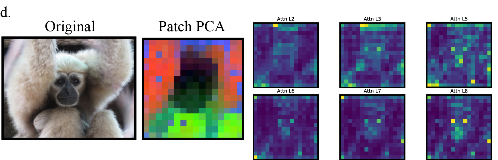

# DINOv2 Feature Extraction and Analysis

Extract and analyze DINOv2 features from primate images. Core functionality:
- Feature extraction from images/directories
- UMAP visualization and clustering
- Active learning subset selection
- Attention visualization



## Installation

```bash
# Ensure you have the PrimateFace environment activated and PyTorch installed before running this command
uv pip install -e ".[dinov2]"
```

## Core Usage

### 1. Extract Features
```python
from dinov2 import DINOv2Extractor

extractor = DINOv2Extractor(model_name="facebook/dinov2-base")
embeddings, image_ids = extractor.extract_from_directory("./images/")
```

Or via CLI:
```bash
python -m dinov2.dinov2_cli extract \
    --input ./images/ \
    --output embeddings.pt
```

### 2. Visualize Features
```python
from dinov2 import UMAPVisualizer

viz = UMAPVisualizer()
viz.fit_transform(embeddings)
viz.plot_interactive("umap.html", show_images=True)
```

Or via CLI:
```bash
python -m dinov2.dinov2_cli visualize \
    --embeddings embeddings.pt \
    --output viz.html \
    --interactive
    --n-clusters 5
    --show-images
```

### 3. Select Diverse Subset
```python
from dinov2 import DiverseImageSelector

selector = DiverseImageSelector(strategy="hybrid")
indices = selector.select(embeddings, n_samples=1000)
```

Or via CLI:
```bash
python -m dinov2.dinov2_cli select \
    --embeddings embeddings.pt \
    --n 1000 \
    --output subset.txt
```

## Model Options

| Model | Parameters | Feature Dim | Speed | Use Case |
|-------|------------|-------------|-------|----------|
| `dinov2-small` | 21M | 384 | Fast | Quick exploration |
| `dinov2-base` | 86M | 768 | Balanced | **Recommended** |
| `dinov2-large` | 300M | 1024 | Slow | High accuracy |
| `dinov2-giant` | 1.1B | 1536 | Very Slow | Best quality |

## Selection Strategies

| Strategy | Description | When to Use |
|----------|-------------|-------------|
| `random` | Random sampling | Baseline comparison |
| `cluster` | K-means based | Fast, good coverage |
| `fps` | Farthest point sampling | Maximum diversity |
| `hybrid` | Cluster + FPS | **Best overall** |

## Common Options

| Option | Description | Default |
|--------|-------------|---------|
| `--batch-size` | Images per batch | 32 |
| `--device` | CUDA device or 'cpu' | cuda |
| `--num-workers` | Data loading threads | 4 |
| `--model` | DINOv2 variant | facebook/dinov2-base |
| `--n-clusters` | UMAP clustering | 100 |
| `--n-neighbors` | UMAP neighborhood size | 15 |
| `--min-dist` | UMAP minimum distance | 0.1 |

## Advanced Features

See central docs (Internals) for:
- Attention visualization
- Memory-efficient processing
- Custom UMAP parameters
- Multi-**layer** analysis
- Batch processing
- Performance optimization

## Troubleshooting

Common issues and solutions:

### CUDA Out of Memory
- Reduce `--batch-size` (try 8 or 16)
- Use smaller model (`dinov2-small`)
- Use `--device cpu` for CPU processing

### Slow Processing
- Increase `--batch-size` if GPU allows
- Increase `--num-workers` for faster loading
- Use smaller model variant

### Import Errors
- Verify installation: `pip install -e ".[dinov2]"`
- Check Python version (requires 3.8+)
- Install missing dependencies: `umap-learn`, `plotly`

## Documentation

- **[API Reference (Internals)](../docs/api/dinov2.md#internals)** - Detailed internals and implementation
- **[Main Documentation](https://docs.primateface.studio)** - Complete PrimateFace documentation
- **[DINOv2 Paper](https://arxiv.org/abs/2304.07193)** - Original publication
