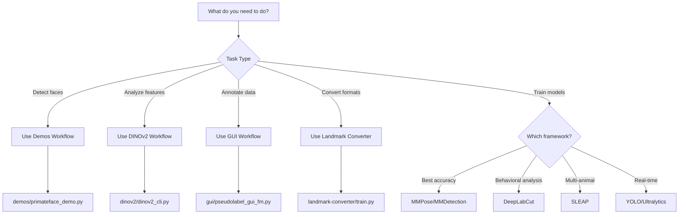

# Which Workflow Should I Use?

Decision guide for choosing the right PrimateFace workflow.

## Quick Decision Tree



## Detailed Decision Guide

### I have images/videos and want to...

#### **Detect faces and landmarks** → [Demos Workflow](../user-guide/core-workflows/demos.md)
```bash
python demos/primateface_demo.py process --input my_image.jpg
```
Best for:
- Quick inference on new data
- Batch processing
- Integration into pipelines

#### **Select best images for annotation** → [DINOv2 Workflow](../user-guide/core-workflows/dinov2.md)
```bash
python dinov2/dinov2_cli.py select --input-dir images/ --n-samples 100
```
Best for:
- Large datasets (1000+ images)
- Limited annotation budget
- Ensuring diversity

#### **Create training annotations** → [GUI Workflow](../user-guide/core-workflows/gui.md)
```bash
python gui/pseudolabel_gui_fm.py --img-dir images/
```
Best for:
- Creating ground truth
- Correcting model predictions
- Interactive annotation

### I have annotations and want to...

#### **Convert between formats** → [Landmark Converter](../user-guide/core-workflows/landmark-converter.md)
```bash
python landmark-converter/apply_model.py --input human_68pt.json --output primate_48pt.json
```
Best for:
- Using human face datasets
- Cross-dataset compatibility
- Framework interoperability

#### **Train detection/pose models** → Choose Framework:

##### **Production deployment** → [MMPose/MMDetection](../user-guide/framework-integration/mmpose-mmdetection.md)
- Highest accuracy
- Best documentation
- PrimateFace primary framework

##### **Behavioral studies** → [DeepLabCut](../user-guide/framework-integration/deeplabcut.md)
- Markerless tracking
- Temporal analysis
- Large community

##### **Multi-animal scenarios** → [SLEAP](../user-guide/framework-integration/sleap.md)
- Identity tracking
- Social interactions
- Optimized for multiple animals

##### **Real-time/edge deployment** → [Ultralytics](../user-guide/framework-integration/ultralytics.md)
- Fastest inference
- Mobile deployment
- Minimal dependencies

### I want to evaluate models...

#### **Compare performance** → [Evaluation Utilities](../user-guide/utilities/evaluation.md)
```bash
python evals/compare_pose_models.py --models mmpose dlc --test-json test.json
```

#### **Visualize results** → [Visualization Utilities](../user-guide/utilities/visualization.md)
```bash
python evals/visualize_eval_results.py --results evaluation.csv
```

## Common Workflows

### Workflow 1: From Raw Images to Trained Model

1. **Collect images** → Organize in folders
2. **Select subset** → DINOv2 selection (optional)
3. **Annotate** → GUI pseudo-labeling
4. **Train** → Choose framework
5. **Evaluate** → Compare metrics

### Workflow 2: Using Pretrained Models

1. **Download models** → `demos/download_models.py`
2. **Run inference** → Demos workflow
3. **Post-process** → Smoothing, filtering
4. **Analyze** → Extract metrics

### Workflow 3: Cross-Dataset Training

1. **Convert annotations** → Landmark converter
2. **Merge datasets** → COCO utilities
3. **Train models** → Framework of choice
4. **Cross-validate** → Evaluation tools

## Framework Selection Matrix

| Framework | Speed | Accuracy | Multi-Animal | Edge Deploy | Learning Curve |
|-----------|-------|----------|--------------|-------------|----------------|
| MMPose    | ★★★☆☆ | ★★★★★    | ★★☆☆☆        | ★★★☆☆       | ★★★☆☆          |
| DeepLabCut| ★★★☆☆ | ★★★★☆    | ★★★☆☆        | ★★☆☆☆       | ★★☆☆☆          |
| SLEAP     | ★★★☆☆ | ★★★★☆    | ★★★★★        | ★★☆☆☆       | ★★☆☆☆          |
| YOLO      | ★★★★★ | ★★★☆☆    | ★★☆☆☆        | ★★★★★       | ★☆☆☆☆          |

## Species-Specific Recommendations

### Great Apes (Gorillas, Chimpanzees, Orangutans)
- Use standard 68-point landmarks
- MMPose for best accuracy
- Consider fur occlusion

### Old World Monkeys (Macaques, Baboons)
- 48-point system works well
- Any framework suitable
- Good for multi-animal SLEAP

### New World Monkeys (Capuchins, Howlers)
- May need custom landmarks
- DINOv2 for feature analysis
- Consider smaller face sizes

### Prosimians (Lemurs, Lorises)
- Specialized models recommended
- Large eye consideration
- Low-light optimization

## Still Unsure?

1. **Start with Demos** - Test pretrained models on your data
2. **Try the GUI** - Explore annotation tools
3. **Check Tutorials** - See similar use cases
4. **Ask Community** - GitHub discussions

## See Also

- [Quick Start](./quickstart.md)
- [Installation](./installation.md)
- [Tutorials](../tutorials/index.md)
- [FAQ](../faq.md)