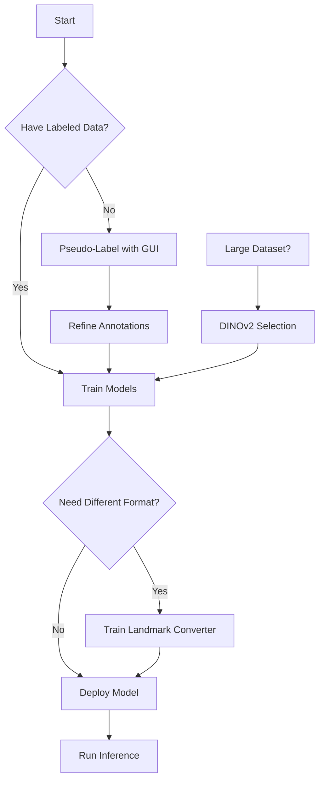

# Workflow Guides

Step-by-step guides for common PrimateFace workflows, from inference with pretrained models to training custom networks.

## Quick Start Workflows

### 🚀 [Inference with Pretrained Models](inference.md)
Get started quickly with PrimateFace's pretrained models for face detection and pose estimation.

**You'll learn:**
- Download and load pretrained models
- Run inference on images and videos
- Interpret and visualize results
- Optimize performance for your hardware

**Time:** 10 minutes

---

### 🎯 [DINOv2-Guided Image Selection](subset-selection.md)
Use self-supervised features to select diverse, representative subsets of your data for efficient training.

**You'll learn:**
- Extract DINOv2 features from your dataset
- Apply different selection strategies
- Compare with random sampling
- Integrate with training pipelines

**Time:** 20 minutes

---

## Training Workflows

### 🔄 [Training a Landmark Converter](landmark-training.md)
Train models to convert between different facial landmark annotation schemes.

**You'll learn:**
- Prepare paired annotation data
- Choose appropriate model architecture
- Train and evaluate converters
- Deploy for production use

**Time:** 30 minutes

---

### 🏷️ [Pseudo-Labeling with GUI](pseudo-labeling.md)
Generate annotations for unlabeled data using the interactive GUI and pretrained models.

**You'll learn:**
- Set up the pseudo-labeling GUI
- Configure detection and pose models
- Refine generated annotations
- Export in various formats

**Time:** 25 minutes

---

### 🏗️ [Training Models in Different Frameworks](framework-training.md)
Train custom models using your annotated data in various deep learning frameworks.

**You'll learn:**
- **MMPose/MMDetection**: Config-based training
- **DeepLabCut**: Markerless tracking setup
- **SLEAP**: Multi-animal pose estimation
- **YOLO**: Real-time detection training
- Performance comparison across frameworks

**Time:** 45 minutes per framework

---

## Workflow Overview



## Choosing the Right Workflow

### By Task

| Task | Recommended Workflow | Time |
|------|---------------------|------|
| Quick testing | [Inference](inference.md) | 10 min |
| Create dataset | [Pseudo-labeling](pseudo-labeling.md) | 25 min |
| Convert annotations | [Landmark training](landmark-training.md) | 30 min |
| Train detector | [Framework training](framework-training.md) | 45 min |
| Reduce data needs | [Subset selection](subset-selection.md) | 20 min |

### By Experience Level

**Beginner** 👶
1. Start with [Inference](inference.md)
2. Try [Pseudo-labeling](pseudo-labeling.md)
3. Explore visualization options

**Intermediate** 🎓
1. [DINOv2 selection](subset-selection.md) for efficiency
2. [Landmark converter](landmark-training.md) training
3. Basic [framework training](framework-training.md)

**Advanced** 🚀
1. Custom model architectures
2. Multi-framework comparison
3. Production deployment

## Prerequisites

### Software Requirements

```bash
# Basic environment
conda create -n primateface python=3.8
conda activate primateface

# Install PrimateFace
git clone https://github.com/KordingLab/PrimateFace.git
cd PrimateFace
pip install -e .

# PyTorch (adjust for your CUDA version)
pip install torch torchvision --index-url https://download.pytorch.org/whl/cu118
```

### Hardware Recommendations

| Workflow | Minimum | Recommended |
|----------|---------|-------------|
| Inference | 4GB RAM, CPU | 8GB VRAM, GPU |
| Training | 8GB RAM, 6GB VRAM | 16GB RAM, 12GB VRAM |
| DINOv2 | 8GB RAM | 16GB RAM, GPU |
| GUI | 4GB RAM | 8GB RAM |

## Tips for Success

### 📊 Data Preparation
- Ensure consistent image quality
- Maintain aspect ratios
- Use COCO format for compatibility
- Include diverse poses and lighting

### ⚙️ Model Selection
- Start with pretrained models
- Use simpler architectures first
- Monitor validation metrics
- Save checkpoints frequently

### 🚀 Performance Optimization
- Batch processing for efficiency
- Mixed precision training
- Gradient accumulation for large batches
- Profile bottlenecks

## Getting Help

### Resources
- **[API Reference](../api/index.md)** - Detailed API documentation
- **[Tutorials](../tutorials/index.md)** - Interactive notebooks
- **[Tools](../tools/index.md)** - Additional utilities

### Community
- [GitHub Issues](https://github.com/KordingLab/PrimateFace/issues) - Report bugs
- [Discussions](https://github.com/KordingLab/PrimateFace/discussions) - Ask questions
- Email: primateface@gmail.com

## Contributing Workflows

Have a workflow that others might find useful? We welcome contributions!

1. Fork the repository
2. Create your workflow guide
3. Follow the existing format
4. Submit a pull request

See our [Contributing Guide](../contribute.md) for details.

## Next Steps

Ready to get started? Choose a workflow above or:

1. **New to PrimateFace?** → Start with [Inference](inference.md)
2. **Have unlabeled data?** → Try [Pseudo-labeling](pseudo-labeling.md)
3. **Ready to train?** → Jump to [Framework training](framework-training.md)
4. **Want efficiency?** → Explore [DINOv2 selection](subset-selection.md)