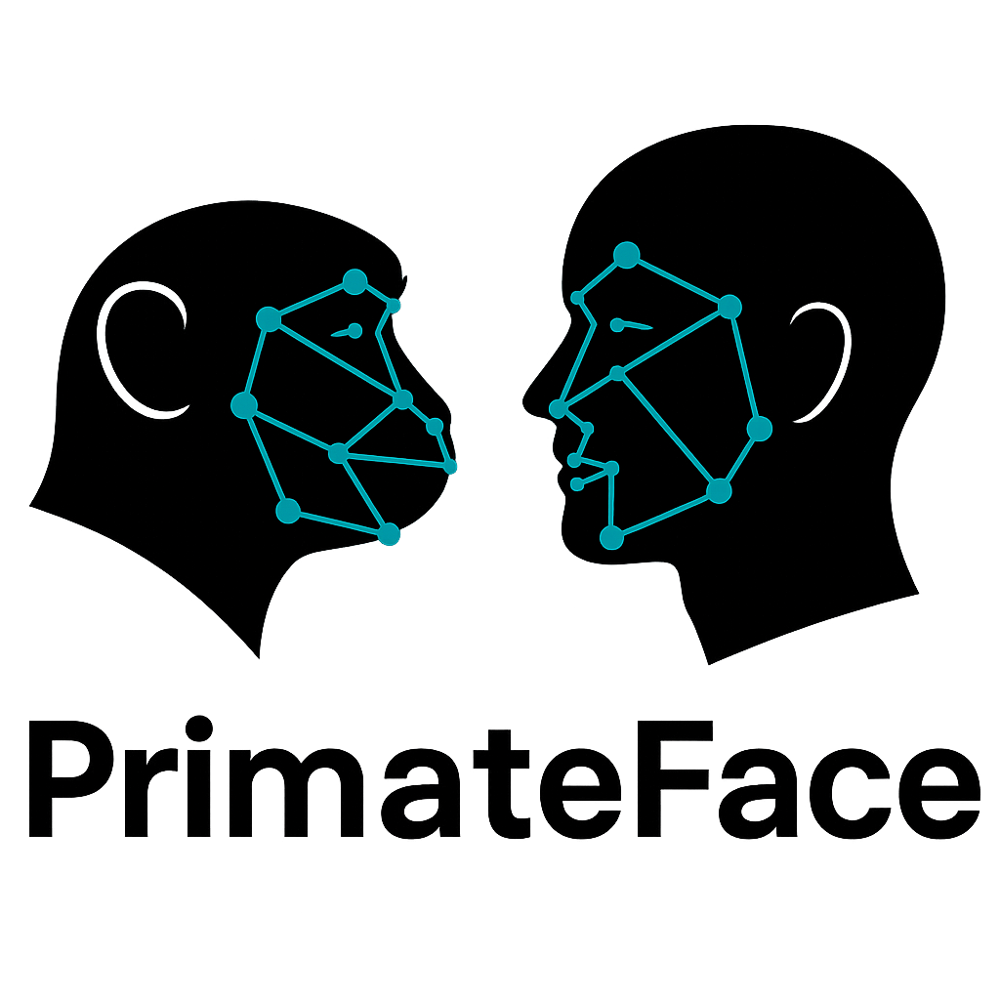
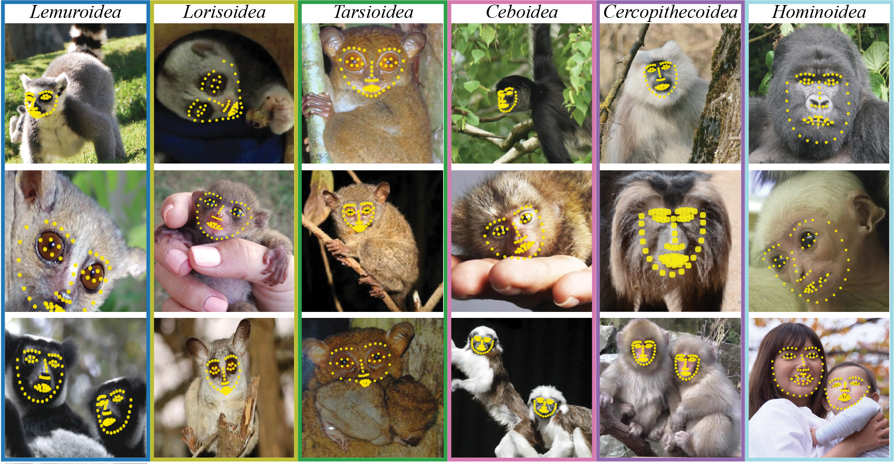

<div style="display: flex; align-items: center; margin-bottom: 20px;">
  
  <div>
    <h1>PrimateFace</h1>
    <h2>Cross-Species Primate Face Detection and Landmark Analysis</h2>
  </div>
</div>

PrimateFace is an open-source toolkit for automated facial analysis across primate species. It provides pretrained models, datasets, and tools for face detection, landmark localization, and behavioral analysis in humans and non-human primates.



## Quick Start

```bash
# 1. Create conda environment
conda env create -f environment.yml
conda activate primateface

# 2. Install PyTorch for your system
# Check your CUDA version: nvcc --version
uv pip install torch==2.1.0 torchvision==0.16.0 --index-url https://download.pytorch.org/whl/cu118

# 3. Install optional modules
uv pip install -e ".[dinov2,gui,dev]"

# 4. Test with demo
python demos/download_models.py
python demos/primateface_demo.py process --input ateles_000003.jpeg \
    --det-config mmdet_config.py --det-checkpoint mmdet_checkpoint.pth
```

## Getting Started

### Installation
See our [detailed installation guide](installation/) or use the quick install above.

### First Steps
1. Try the demos → [Quick inference guide](user-guide/core-workflows/demos.md)
2. Explore notebooks → [Interactive tutorials](tutorials/index.md) 
3. Choose your workflow → [Decision tree](getting-started/decision-tree/)
4. Read the paper → [Scientific background](paper.md)

## Project Components

### Dataset
Comprehensive primate face dataset with annotations.
- 68-point facial landmarks
- 49-point simplified annotations
- Bounding boxes and species labels

### Models
Pretrained models optimized for primates.
- Face detection (MMDetection, Ultralytics)
- Pose estimation (MMPose, DeepLabCut, SLEAP)
- Species classification (VLMs)
- Landmark converters

## Documentation

### 📚 [Getting Started](getting-started/)
- [Installation Guide](installation/)
- [Quickstart Tutorial](getting-started/quickstart/)
- [Which Workflow to Use?](getting-started/decision-tree/)

### 🎓 [Tutorials](tutorials/index.md)
Interactive notebooks demonstrating applications:
- Lemur face visibility time-stamping
- Macaque face recognition
- Howler vocal-motor coupling
- Gaze following analysis

### 📖 [User Guide](user-guide/index.md)

#### [Core Workflows](user-guide/core-workflows/index.md)
- **[Demos](user-guide/core-workflows/demos.md)** - Complete inference pipeline
- **[DINOv2](user-guide/core-workflows/dinov2.md)** - Feature extraction & visualization
- **[GUI](user-guide/core-workflows/gui.md)** - Interactive annotation workflow
- **[Landmark Converter](user-guide/core-workflows/landmark-converter.md)** - Format conversion

#### [Framework Integration](user-guide/framework-integration/index.md)
- **[MMPose/MMDetection](user-guide/framework-integration/mmpose-mmdetection.md)** - Primary framework
- **[DeepLabCut](user-guide/framework-integration/deeplabcut.md)** - Behavioral analysis  
- **[SLEAP](user-guide/framework-integration/sleap.md)** - Multi-animal tracking
- **[Ultralytics](user-guide/framework-integration/ultralytics.md)** - Real-time detection

#### [Utilities](user-guide/utilities/index.md)
- **[Evaluation](user-guide/utilities/evaluation.md)** - Model comparison & metrics
- **[Data Processing](user-guide/utilities/data-processing.md)** - Format converters
- **[Visualization](user-guide/utilities/visualization.md)** - Plotting & analysis

#### [Concepts](user-guide/concepts.md)
- Facial landmarks (68-point vs 48-point)
- DINOv2 features explained
- Evaluation metrics

### 🔧 [API Reference](api/index.md)
- **Core APIs**: [Detection](api/detection.md), [Pose](api/pose.md), [Annotation](api/annotation.md)
- **Feature APIs**: [DINOv2](api/dinov2.md), [Converter](api/converter.md), [Evaluation](api/evaluation.md)

### 📊 [Data & Models](data-models/index.md)
- Pretrained model downloads
- Dataset specifications
- COCO format guide

### 🛠️ [Troubleshooting](troubleshooting.md)
- Common issues and solutions
- Performance optimization

### 🤝 [Contributing](contribute.md)
- Submit your primate images
- Contribute to the dataset

## Community

### Get Help
- GitHub Issues: [Report bugs](https://github.com/KordingLab/PrimateFace/issues)
- Discussions: [Ask questions](https://github.com/KordingLab/PrimateFace/discussions)

For pressing questions or collaborations, reach out via:

- **PrimateFace Email**: [primateface@gmail.com](mailto:primateface@gmail.com)

- **Felipe Parodi Email**: [fparodi@upenn.edu](mailto:fparodi@upenn.edu)

### Resources
- [Scientific Paper](paper.md)
- [Model Zoo](models.md)
- [Dataset Access](data.md)

## Citation

If you use PrimateFace in your research, please cite:

[Parodi et al., 2025](https://www.biorxiv.org/content/10.1101/2025.08.12.669927v2)

```bibtex
@article{parodi2025primateface,
  title={PrimateFace: A Machine Learning Resource for Automated Face Analysis in Human and Non-human Primates},
  author={Parodi, Felipe and Matelsky, Jordan and Lamacchia, Alessandro and Segado, Melanie and Jiang, Yaoguang and Regla-Vargas, Alejandra and Sofi, Liala and Kimock, Clare and Waller, Bridget M and Platt, Michael and Kording, Konrad P},
  journal={bioRxiv},
  pages={2025--08},
  year={2025},
  publisher={Cold Spring Harbor Laboratory}
}
```

## License

This project is released under the MIT License for research purposes.

---

<div align="center">
  <a href="https://github.com/KordingLab/PrimateFace">GitHub</a> •
  <a href="https://primateface.studio">Website</a> •
  <a href="paper.md">Paper</a> •
  <a href="data.md">Dataset</a> •
  <a href="models.md">Models</a>
</div>
