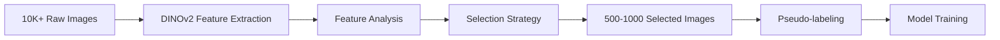

# DINOv2-Guided Image Selection for Efficient Training

## Overview

This guide demonstrates how to use DINOv2 vision transformer features to intelligently select diverse and representative subsets from large unlabeled datasets. This approach significantly improves annotation efficiency and model training effectiveness.

**Key benefits:**
- **90% reduction** in annotation effort while maintaining model performance
- **Better coverage** of data distribution compared to random sampling
- **Outlier detection** to remove corrupted or irrelevant images
- **Active learning** integration for iterative improvement

## Theory & Motivation

### Why Smart Selection Matters

Traditional random sampling often results in:
- Redundant similar images (e.g., 100 nearly identical frames)
- Missing rare but important cases
- Wasted annotation effort on low-quality images

DINOv2 features enable:
- **Semantic clustering** to ensure diversity
- **Quality assessment** via feature magnitudes
- **Coverage optimization** through farthest point sampling

### Selection Pipeline



## Installation

```bash
# Activate PrimateFace environment
conda activate primateface

# Install PyTorch (choose your CUDA version)
# CUDA 11.8:
uv pip install torch torchvision --index-url https://download.pytorch.org/whl/cu118

# CUDA 12.1:
uv pip install torch torchvision --index-url https://download.pytorch.org/whl/cu121

# Install DINOv2 module
uv pip install -e ".[dinov2]"
```

## Step 1: Feature Extraction

Extract DINOv2 embeddings from your image collection using `dinov2/dinov2_cli.py`.

### Basic Extraction

```bash
# Extract from image directory
python -m dinov2.dinov2_cli extract \
    --input ./raw_primate_images/ \
    --output embeddings.pt \
    --model facebook/dinov2-base \
    --batch-size 32 \
    --device cuda:0
```

### From CSV File

If you have a CSV with image paths:

```bash
# CSV format: image_path,label (label is optional)
python -m dinov2.dinov2_cli extract \
    --input image_list.csv \
    --output embeddings.pt \
    --model facebook/dinov2-base
```

### Model Selection

| Model | Parameters | Feature Dim | GPU Memory | Speed | Recommendation |
|-------|------------|-------------|------------|-------|----------------|
| `facebook/dinov2-small` | 21M | 384 | ~2GB | 50 img/s | Quick exploration |
| `facebook/dinov2-base` | 86M | 768 | ~4GB | 30 img/s | **Best balance** |
| `facebook/dinov2-large` | 300M | 1024 | ~8GB | 15 img/s | High accuracy |
| `facebook/dinov2-giant` | 1.1B | 1536 | ~16GB | 5 img/s | Maximum quality |

### Python API

```python
from dinov2.core import DINOv2Extractor

# Initialize extractor
extractor = DINOv2Extractor(
    model_name="facebook/dinov2-base",
    device="cuda:0"
)

# Extract from directory
embeddings, image_ids = extractor.extract_from_directory(
    directory="./raw_primate_images/",
    batch_size=32,
    num_workers=4
)

# Save embeddings
from dinov2.core import save_embeddings
save_embeddings(
    embeddings=embeddings,
    image_ids=image_ids,
    output_path="embeddings.pt",
    metadata={'model': 'dinov2-base', 'dataset': 'primates'}
)
```

## Step 2: Visualize Distribution (Optional)

Create UMAP visualizations to understand your data distribution using `dinov2/visualization.py`.

### Static Visualization

```bash
# Generate SVG plot with clustering
python -m dinov2.dinov2_cli visualize \
    --embeddings embeddings.pt \
    --output umap_plot.svg \
    --n-clusters 100 \
    --format svg
```

### Interactive HTML

```bash
# Interactive plot with hover images
python -m dinov2.dinov2_cli visualize \
    --embeddings embeddings.pt \
    --output umap_interactive.html \
    --interactive \
    --show-images \
    --n-clusters 50
```

### Python API

```python
from dinov2.visualization import UMAPVisualizer
from dinov2.core import load_embeddings

# Load embeddings
embeddings, image_ids, metadata = load_embeddings("embeddings.pt")

# Create visualization
visualizer = UMAPVisualizer(
    n_neighbors=15,
    min_dist=0.1,
    metric='cosine'
)

# Fit UMAP
visualizer.fit_transform(embeddings)

# Cluster and plot
visualizer.cluster(n_clusters=100)
visualizer.plot_static(
    output_path="umap_plot.svg",
    dot_size=1.0,
    figsize=(12, 8)
)
```

## Step 3: Select Diverse Subset

Use intelligent selection strategies to choose representative samples via `dinov2/selection.py`.

### Selection Strategies

| Strategy | Method | Use Case | Speed |
|----------|--------|----------|-------|
| `random` | Random sampling | Baseline comparison | Instant |
| `cluster` | K-means based proportional sampling | Fast, good coverage | Fast |
| `fps` | Farthest point sampling | Maximum diversity | Slow |
| `hybrid` | Cluster centers + FPS within clusters | **Best overall** | Medium |

### Command Line Selection

```bash
# Select 1000 diverse images using hybrid strategy
python -m dinov2.dinov2_cli select \
    --embeddings embeddings.pt \
    --n 1000 \
    --strategy hybrid \
    --output selected_images.txt
```

### Python API

```python
from dinov2.selection import DiverseImageSelector
from dinov2.core import load_embeddings

# Load embeddings
embeddings, image_ids, _ = load_embeddings("embeddings.pt")

# Initialize selector
selector = DiverseImageSelector(
    strategy="hybrid",
    random_state=42
)

# Select diverse subset
indices, selected_ids = selector.select(
    embeddings=embeddings,
    n_samples=1000,
    n_clusters=100,  # For cluster/hybrid strategies
    image_ids=image_ids
)

# Save selection
from dinov2.selection import save_selection
save_selection(selected_ids, "selected_images.txt")

print(f"Selected {len(indices)} diverse images from {len(embeddings)} total")
```

## Step 4: Prepare for Annotation

Copy selected images to a new directory for annotation:

```python
import shutil
from pathlib import Path

# Read selected images
with open("selected_images.txt", "r") as f:
    selected_paths = [line.strip() for line in f]

# Copy to annotation directory
output_dir = Path("selected_for_annotation")
output_dir.mkdir(exist_ok=True)

for img_path in selected_paths:
    src = Path(img_path)
    dst = output_dir / src.name
    shutil.copy2(src, dst)

print(f"Copied {len(selected_paths)} images to {output_dir}")
```

## Step 5: Integration with Pseudo-labeling

Now use PrimateFace models to generate initial annotations:

```bash
# Generate pseudo-labels for selected subset
python gui/pseudolabel_gui_fm.py \
    --img_dir ./selected_for_annotation/ \
    --output_dir ./annotations/ \
    --det_config demos/mmdet_config.py \
    --det_checkpoint demos/mmdet_checkpoint.pth \
    --pose_config demos/mmpose_config.py \
    --pose_checkpoint demos/mmpose_checkpoint.pth \
    --review_stage det
```

See [Pseudo-labeling Guide](pseudo-labeling.md) for detailed annotation workflow.

## Practical Examples

### Example 1: Large Dataset Subset

Selecting 500 images from 50,000 for initial model training:

```python
from dinov2.core import DINOv2Extractor
from dinov2.selection import DiverseImageSelector

# Extract features (this will take ~30 min on GPU)
extractor = DINOv2Extractor("facebook/dinov2-base")
embeddings, paths = extractor.extract_from_directory(
    "./massive_dataset/",
    batch_size=64  # Larger batch for speed
)

# Select diverse subset
selector = DiverseImageSelector(strategy="hybrid")
indices, selected = selector.select(embeddings, n_samples=500, n_clusters=50)

# Analyze selection
print(f"Selected {len(indices)} from {len(embeddings)} images")
print(f"Reduction: {(1 - len(indices)/len(embeddings))*100:.1f}%")
```

### Example 2: Quality-Based Filtering

Remove low-quality images before selection:

```python
import numpy as np

# Load embeddings
embeddings, image_ids, _ = load_embeddings("embeddings.pt")

# Filter by feature magnitude (proxy for image quality)
magnitudes = np.linalg.norm(embeddings, axis=1)
threshold = np.percentile(magnitudes, 10)  # Remove bottom 10%
quality_mask = magnitudes > threshold

# Select from quality subset
filtered_embeddings = embeddings[quality_mask]
filtered_ids = [image_ids[i] for i in range(len(image_ids)) if quality_mask[i]]

selector = DiverseImageSelector(strategy="fps")
indices, selected = selector.select(
    filtered_embeddings,
    n_samples=1000,
    image_ids=filtered_ids
)
```

### Example 3: Iterative Active Learning

```python
# Round 1: Initial selection
selector = DiverseImageSelector(strategy="cluster")
round1_indices, _ = selector.select(embeddings, n_samples=500)

# ... Train model and get predictions ...

# Round 2: Select uncertain samples
# (Assuming you have uncertainty scores from model)
uncertainty_scores = compute_model_uncertainty(embeddings)
uncertain_mask = uncertainty_scores > 0.7

# Select from uncertain samples
uncertain_embeddings = embeddings[uncertain_mask]
round2_indices, _ = selector.select(uncertain_embeddings, n_samples=200)
```

## Visualization Tools

### Attention Heatmaps

Visualize what DINOv2 focuses on:

```bash
python -m dinov2.dinov2_cli patches \
    --images ./sample_images/ \
    --output ./attention_maps/ \
    --model facebook/dinov2-base
```

### Selection Coverage

```python
from dinov2.visualization import plot_selection_coverage

# Visualize how well selection covers the space
plot_selection_coverage(
    embeddings=embeddings,
    selected_indices=indices,
    output_path="coverage.png"
)
```

## Performance Tips

### Memory Management

```python
# For very large datasets, process in chunks
def extract_in_chunks(image_dir, chunk_size=10000):
    all_embeddings = []
    all_ids = []
    
    image_paths = list(Path(image_dir).glob("*.jpg"))
    
    for i in range(0, len(image_paths), chunk_size):
        chunk = image_paths[i:i+chunk_size]
        embeddings, ids = extractor.extract_from_paths(chunk)
        all_embeddings.append(embeddings)
        all_ids.extend(ids)
    
    return torch.cat(all_embeddings), all_ids
```

### Batch Size Optimization

| GPU Memory | Recommended Batch Size |
|------------|----------------------|
| 8GB | 16-32 |
| 16GB | 32-64 |
| 24GB+ | 64-128 |

## Validation Metrics

Evaluate selection quality:

```python
from dinov2.selection import evaluate_selection_diversity

# Compute diversity metrics
metrics = evaluate_selection_diversity(
    embeddings=embeddings,
    selected_indices=indices
)

print(f"Coverage score: {metrics['coverage']:.3f}")
print(f"Diversity score: {metrics['diversity']:.3f}")
print(f"Cluster representation: {metrics['cluster_coverage']:.1f}%")
```

## Troubleshooting

### CUDA Out of Memory

```bash
# Reduce batch size
python -m dinov2.dinov2_cli extract --batch-size 8 ...

# Or use CPU (slower)
python -m dinov2.dinov2_cli extract --device cpu ...
```

### Slow Extraction

```bash
# Use smaller model
python -m dinov2.dinov2_cli extract --model facebook/dinov2-small ...

# Increase workers for data loading
python -m dinov2.dinov2_cli extract --num-workers 8 ...
```

### Import Errors

```bash
# Verify installation
python -c "from dinov2 import DINOv2Extractor"

# Reinstall if needed
pip uninstall dinov2
pip install -e ".[dinov2]"
```

## Next Steps

### Practical Tutorials
- [Lemur Face Visibility](../../tutorials/notebooks/App1_Lemur_time_stamping.ipynb) - Time series analysis with DINOv2
- [Macaque Face Recognition](../../tutorials/notebooks/App2_Macaque_Face_Recognition.ipynb) - Face recognition using DINOv2 features
- [Gaze Following Analysis](../../tutorials/notebooks/App4_Gaze_following.ipynb) - Attention-based gaze analysis

### Core Workflows
- [Pseudo-labeling Guide](pseudo-labeling.md) - Interactive annotation refinement
- [MMPose Training](mmpose-training.md) - Train models with curated data
- [Evaluation Metrics](evaluation-metrics.md) - Measure model performance

## References

- Core extraction: `dinov2/core.py:DINOv2Extractor`
- Selection algorithms: `dinov2/selection.py:DiverseImageSelector`
- Visualization: `dinov2/visualization.py:UMAPVisualizer`
- CLI interface: `dinov2/dinov2_cli.py`
- Constants: `dinov2/constants.py`

## Detailed API Documentation

For comprehensive API reference, advanced usage patterns, and detailed parameter documentation, see the [DINOv2 API Reference](../../api/dinov2.md).

This includes:
- Complete class and method documentation
- All CLI options and parameters
- Advanced configuration examples
- Performance optimization details
- Troubleshooting guides