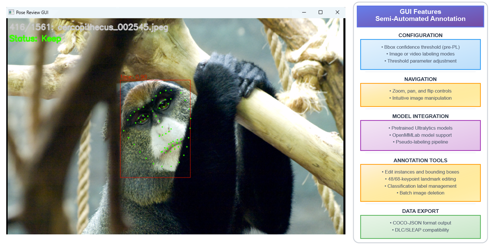

# GUI Module - Interactive Pseudo-Labeling and Refinement

Generate and refine annotations for primate face analysis. Core functionality:
- Multi-framework detection (MMDetection, Ultralytics)
- Pose estimation with flexible skeletons
- SAM-based mask refinement
- Interactive annotation GUI
- Parallel GPU processing



## Installation

```bash
# Core dependencies
uv pip install -e ".[gui]"

# Optional: SAM support
pip install segment-anything ultralytics
```

## Core Usage

### 1. Generate Annotations

```python
from gui import Detector, PoseEstimator, ImageCOCOConverter

# Initialize models
detector = Detector("mmdet", config_path="det.py", checkpoint_path="det.pth")
pose = PoseEstimator("mmpose", config_path="pose.py", checkpoint_path="pose.pth")

# Process images
converter = ImageCOCOConverter(detector, pose, output_dir="./output")
json_path = converter.process_directory("./images")
```

Or via CLI:
```bash
python -m gui.pseudolabel generate \
    --input ./images --type image \
    --det-checkpoint det.pth \
    --pose-checkpoint pose.pth \
    --output-dir ./output
```

### 2. Process Videos

```python
from gui import VideoCOCOConverter

converter = VideoCOCOConverter(detector, pose, frame_interval=30)
json_path = converter.process_video("./video.mp4")
```

Or via CLI:
```bash
python -m gui.pseudolabel generate \
    --input ./videos --type video \
    --det-checkpoint det.pth \
    --frame-interval 30 \
    --output-dir ./output
```

### 3. Refine Annotations

```python
from gui.refinement import COCORefinementGUI
import tkinter as tk

root = tk.Tk()
gui = COCORefinementGUI(root, coco_path="annotations.json", images_dir="./images")
root.mainloop()
```

Or via CLI:
```bash
python -m gui.pseudolabel refine \
    --coco annotations.json \
    --images ./images \
    --output refined.json
```

## Framework Options

| Framework | Detection | Pose | Use Case |
|-----------|-----------|------|-------|
| `mmdet` | ✓ | | **Recommended** |
| `mmpose` | | ✓ | **Recommended** |
| `ultralytics` | ✓ | ✓ | Real-time |
| `deeplabcut` | ✓ | ✓ | Behavioral |
| `sleap` | ✓ | ✓ | Multi-animal |

## Processing Modes

| Mode | Description | When to Use |
|------|-------------|-------------|
| `generate` | Auto-annotate with models | Initial labeling |
| `detect` | Detection only | Bounding boxes |
| `pose` | Add poses to detections | Keypoint refinement |
| `refine` | Interactive GUI | Manual correction |

## Common Options

| Option | Description | Default |
|--------|-------------|---------|
| `--device` | CUDA device or 'cpu' | cuda:0 |
| `--bbox-thr` | Detection confidence | 0.3 |
| `--nms-thr` | NMS IoU threshold | 0.9 |
| `--max-instances` | Max faces per image | 3 |
| `--kpt-thr` | Keypoint confidence | 0.05 |
| `--frame-interval` | Video frame sampling | 30 |
| `--save-viz` | Save visualizations | False |

## Advanced Features

### Parallel GPU Processing
```bash
python -m gui.pseudolabel generate \
    --input ./videos --type video \
    --det-checkpoint det.pth \
    --gpus 0 1 2 3 \
    --jobs-per-gpu 2
```

### SAM Mask Refinement
```bash
python -m gui.pseudolabel generate \
    --input ./images --type image \
    --det-checkpoint det.pth \
    --sam-checkpoint sam_vit_h.pth
```

### Custom Skeleton from COCO
```bash
python -m gui.pseudolabel generate \
    --input ./images --type image \
    --det-checkpoint det.pth \
    --pose-checkpoint pose.pth \
    --coco-template existing_annotations.json
```

## GUI Controls

### Detection Review
| Key | Action |
|-----|--------|
| `Space` | Accept and next |
| `Delete` | Remove bbox |
| `a` | Add new bbox |
| `r` | Reset |
| `s` | Save progress |
| `←/→` | Navigate |

### Pose Review
| Key | Action |
|-----|--------|
| `Space` | Accept and next |
| `v` | Toggle visibility |
| `1-9` | Set confidence |
| `h` | Toggle skeleton |
| `z/x` | Point size |

## Troubleshooting

### CUDA Out of Memory
- Reduce `--max-instances` (try 1)
- Use `--device cpu` for CPU processing
- Process in smaller batches

### Import Errors
- Verify installation: `pip install -e ".[gui]"`
- Install frameworks: `mim install mmdet mmpose`
- Check Python version (requires 3.8+)

### Detection Issues
- Lower `--bbox-thr` for more detections (try 0.1)
- Adjust `--nms-thr` for overlapping faces (try 0.5)
- Check model compatibility with your species

## Documentation

- **[API Reference](../docs/api/gui.md)** - Detailed API documentation
- **[User Guide](../docs/user-guide/core-workflows/gui.md)** - Complete workflow guide
- **[Main Documentation](https://docs.primateface.studio)** - PrimateFace documentation