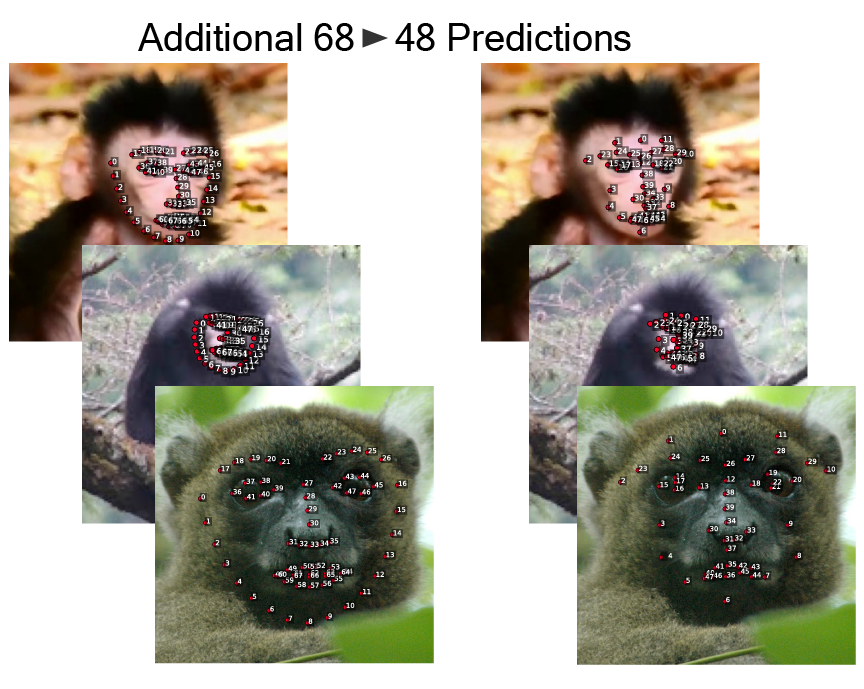

# Landmark Converter

Convert facial landmarks between different annotation schemes (e.g., 68→49 points). Core functionality:
- Flexible keypoint format conversion
- Multiple model architectures (Linear, MLP, Attention)
- COCO format support
- Batch processing



## Installation

```bash
# After activating primateface environment
uv pip install -e ".[landmark_gnn]"  # Optional: for GNN models
```

## Core Usage

### 1. Train Converter
```python
from src.models import KeypointConverterMLP
from utils.data_utils import CocoPairedKeypointDataset

# Initialize model
model = KeypointConverterMLP(num_source_kpts=68, num_target_kpts=49)

# Train
dataset = CocoPairedKeypointDataset("annotations.json")
trainer = ModelTrainer(model, dataset)
trainer.train(epochs=100)
```

Or via CLI:
```bash
python train.py \
    --model mlp \
    --coco_json annotations.json \
    --epochs 100
```

### 2. Apply Converter
```python
from src.models import KeypointConverterMLP
from utils.data_utils import normalize_keypoints_bbox

# Load model
model = KeypointConverterMLP(num_source_kpts=68, num_target_kpts=49)
model.load_state_dict(torch.load('best_model.pth')['model_state_dict'])

# Convert keypoints
keypoints = torch.randn(1, 68, 2)  # [batch, num_kpts, 2]
bbox = torch.tensor([[100, 100, 200, 200]])
converted = model(normalize_keypoints_bbox(keypoints, bbox))
```

Or via CLI:
```bash
python apply_model.py \
    --model_path best_model.pth \
    --coco_json test.json \
    --output_dir predictions/
```

## Model Architectures

| Model | Parameters | Speed | Use Case |
|-------|------------|-------|----------|
| `simple_linear` | ~7K | Fast | Baseline/testing |
| `mlp` | ~85K | Balanced | **Recommended** |
| `mlp_attention` | ~51K | Medium | Complex mappings |
| `gnn` | Varies | Slow | Structure preservation |

## Conversion Modes

| Mode | Description | When to Use |
|------|-------------|-------------|
| `68_to_49` | Standard conversion | **Most common** |
| `49_to_68` | Reverse mapping | Upsampling |
| `custom` | User-defined | Special cases |

## Common Options

| Option | Description | Default |
|--------|-------------|---------|
| `--model` | Model architecture | mlp |
| `--epochs` | Training epochs | 100 |
| `--batch_size` | Batch size | 32 |
| `--lr` | Learning rate | 1e-3 |
| `--val_split` | Validation ratio | 0.15 |
| `--augment` | Enable augmentation | False |

## Advanced Features

See [Technical Documentation](converter_docs.md) for:
- Custom conversion modes
- Model architecture details
- Training strategies
- Performance optimization
- Evaluation metrics

## Troubleshooting

### Poor Accuracy
- Try attention model: `--model mlp_attention`
- Increase epochs: `--epochs 1000`
- Enable augmentation: `--augment`

### CUDA Out of Memory
- Reduce batch size: `--batch_size 16`
- Use CPU: `--gpu_id -1`
- Try simpler model: `--model simple_linear`

### Data Format Issues
- Verify COCO JSON structure
- Check keypoint array lengths
- Ensure `num_keypoints` fields match

## Documentation

- **[Technical Reference](converter_docs.md)** - Detailed API documentation
- **[Training Guide](../docs/guides/landmark-training.md)** - Step-by-step tutorial
- **[Main Documentation](https://docs.primateface.studio)** - Complete documentation